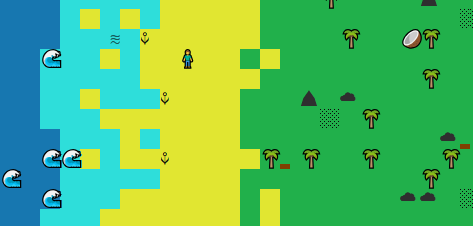

====================================================================================================================
			#CY VALLEY : ESTEBAN ABEHZELE, ILAN DASSONVILLE ET NICOLAS LAGRANGE

#Note :
	Le jeu utilise le terminal Linux comme moyen d'affichage, il y a donc peu de chances qu'il fonctionne sur Windows.

#Synopsis : 
		Vous êtes échoué sur une île déserte, enfin pas si déserte que ça. 
	En effet, il vous faudra l'explorer afin de découvrir comment s'échapper de celle ci. 
	Pour ce faire, vous allez devoir récolter des ressources et vous lier d'amitié avec les habitants de cet île....
	Il paraît qu'une mystérieuse épave a été aperçu sur la plage Ouest de l'île.

#Les commandes : 
	`Z/Q/S/D` :	
		Classique, comme souvent, ce sont les touches de déplacement.
			Z : ^
		Q : <-	S : v	D : ->
		
	`E` :	
		Pour interagir avec la case devant le personnage. Cela peut permettre de casser des objets, 
		récupérer des ressources et toute sorte de choses.
		
	`A` :	
		Cette touche permet de revenir dans le menu, mais pas de panique, vous pouvez toujours utiliser le bouton
		"REPRENDRE JEU" pour retrouver votre progression.
		
	`ESPACE` :	
		Cette touche permet de quitter instantanément le jeu soit sans passer 
		par le bouton "QUITTER LE JEU" du menu.

#Comment éxécuter et lancer le jeu (sur Linux) :
	1 - Dans le dossier du jeu (au même niveau que le readme), ouvrez le terminal.
	2 - Entrez la commande "make".
  	    2.BIS - Si la compilation échoue, faites "gcc -o main src/*.c -lncursesw".
	3 - Il ne vous restes plus qu'à faire "./main" pour lancer le jeu.
 
 ====================================================================================================================
